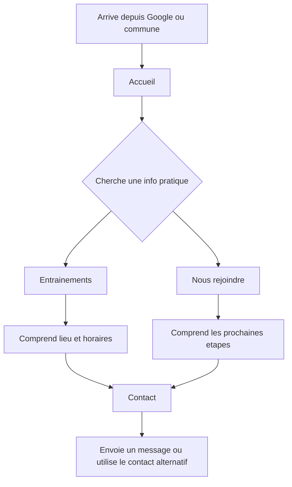
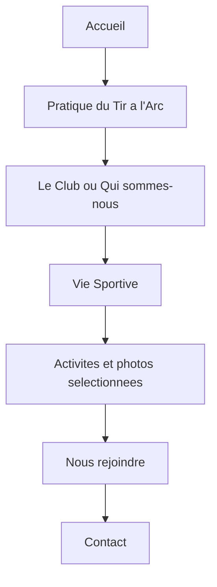
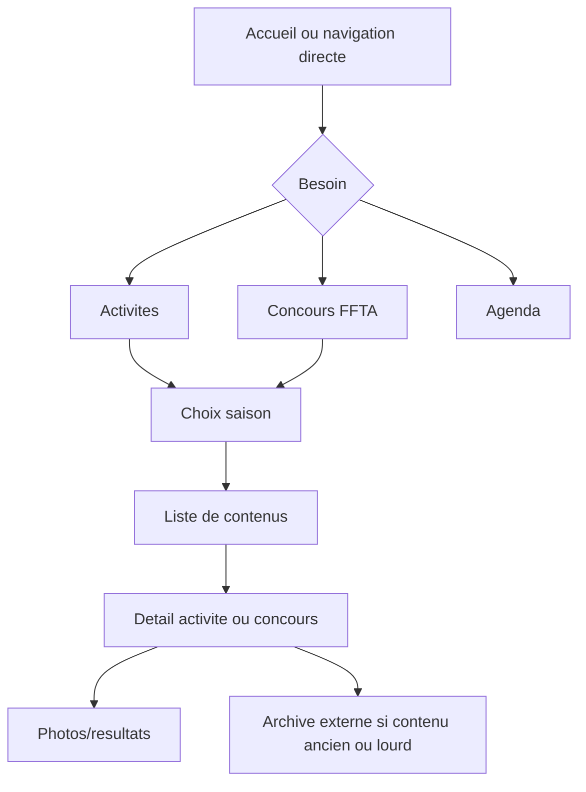
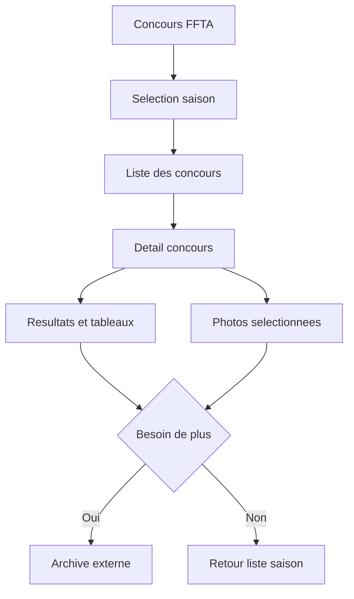
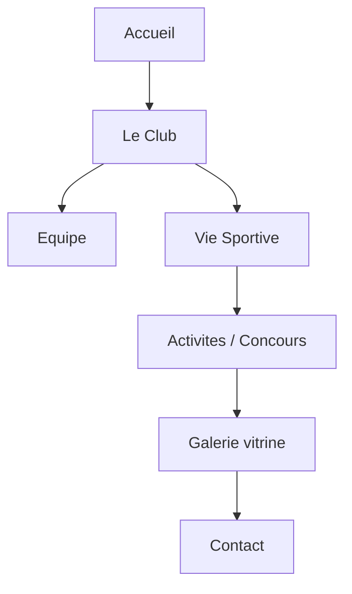

---
stepsCompleted:
  - step-01-init
  - step-02-discovery
  - step-03-core-experience
  - step-04-emotional-response
  - step-05-inspiration
  - step-06-design-system
  - step-07-defining-experience
  - step-08-visual-foundation
  - step-09-design-directions
  - step-10-user-journeys
  - step-11-component-strategy
  - step-12-ux-patterns
  - step-13-responsive-accessibility
  - step-14-complete
lastStep: 14
inputDocuments:
  - _bmad-output/planning-artifacts/prd.md
workflowType: ux-design
projectName: amtta-site
createdFor: Lot 1 / MVP
status: complete
---

# UX Design Specification - amtta-site

**Auteur :** Jonathan  
**Date :** 2026-05-11  
**Source principale :** `_bmad-output/planning-artifacts/prd.md`

## Executive Summary

### Vision UX

`amtta-site` doit devenir le point d'entree clair, moderne et vivant de l'AMTTA, sans rompre les reperes du site Wix existant. Le Lot 1 / MVP n'est pas une refonte radicale : c'est une migration modernisee qui conserve la logique fonctionnelle principale, clarifie les parcours et pose une base statique maintenable avec Astro, Vue et Tailwind.

L'experience doit aider un visiteur a comprendre rapidement :

- ce qu'est l'AMTTA ;
- ou et quand pratiquer ;
- comment rejoindre ou contacter le club ;
- ce qui se passe dans la saison en cours ;
- ou retrouver activites, concours, resultats, photos et archives.

### Objectifs UX MVP

- Conserver une navigation proche de l'existant pour les membres et visiteurs recurrents.
- Rendre les informations pratiques accessibles en 2 a 3 clics depuis l'accueil.
- Structurer Activites et Concours par saison, avec 3 saisons visibles directement.
- Limiter les photos embarquees sur le site et externaliser les archives lourdes.
- Offrir une consultation confortable sur mobile et desktop.
- Soutenir la maintenabilite par fichiers Markdown, JSON ou donnees simples.
- Preparer un futur dark mode sans l'inclure dans le Lot 1.

### Publics Cibles

- **Parents et familles :** cherchent horaires, lieux, accueil jeunes, inscription et contact.
- **Adultes debutants ou reprenants :** veulent comprendre la pratique, l'ambiance, le club et la marche a suivre.
- **Membres AMTTA :** consultent activites, concours, resultats, agenda, photos et archives.
- **Participants ou visiteurs de concours :** cherchent une competition, des resultats, quelques photos et eventuellement une archive externe.
- **Commune et partenaires :** evaluent le serieux, l'activite et l'ancrage local du club.
- **Developpeur-mainteneur :** met a jour contenus, saisons, concours, photos et liens sans CMS ni backend.

### Principaux Defis UX

- Moderniser sans perdre les reperes de navigation Wix.
- Rendre les contenus saisonniers lisibles sans creer une rubrique d'actualites permanente.
- Afficher resultats, tableaux et informations pratiques sans debordement mobile.
- Montrer un club actif avec peu de photos embarquees.
- Integrer agenda, contact et archives externes sans creer de dependance lourde.

## Core User Experience

### Experience Centrale

L'experience centrale est l'orientation rapide vers la bonne information. Le site doit fonctionner comme une vitrine associative structuree : chaque visiteur arrive avec une intention simple, puis trouve un chemin court vers une page claire.

La page d'accueil joue le role de carrefour :

- decouvrir le club ;
- consulter les horaires et lieux ;
- rejoindre ou contacter ;
- voir la saison en cours ;
- acceder aux concours, activites, agenda et photos.

### Strategie Plateforme

- **Type :** site statique multi-pages Astro.
- **Interactivite :** Vue uniquement pour les composants qui le justifient, comme menu mobile, filtres simples de saison ou composants agenda si necessaire.
- **Styles :** Tailwind, avec un systeme de composants sobre et coherent.
- **Backend :** aucun backend applicatif, aucune authentification, aucun espace membre, aucune base de donnees.
- **Contenus :** Markdown, JSON ou collections de contenu simples.
- **Integrations :** formulaire statique compatible Netlify Forms, Formspree ou equivalent ; agenda Google ou equivalent ; archives via Google Drive ou equivalent.

### Interactions Qui Doivent Etre Evidentes

- Ouvrir la navigation mobile et comprendre les rubriques.
- Trouver les horaires et le lieu depuis l'accueil.
- Passer d'une saison a l'autre dans Activites et Concours.
- Identifier le contenu recent ou courant.
- Lire un resultat ou tableau sur mobile.
- Envoyer un message depuis Contact.
- Acceder a une archive externe lorsque le contenu lourd n'est pas sur le site.

### Moments de Succes

- Un parent sait en moins de 2 minutes si le club convient a son enfant et comment demander des informations.
- Un adulte comprend que le club est accessible, actif et organise.
- Un membre retrouve rapidement un concours, une activite, un resultat ou une photo.
- Un partenaire percoit une association vivante et fiable.
- Le mainteneur peut ajouter une saison ou une page sans reconstruire mentalement tout le site.

### Principes d'Experience

1. **Continuite avant originalite :** garder les reperes fonctionnels du site existant.
2. **Clarte avant densite :** chaque page doit avoir une intention principale.
3. **Saisons visibles, archives legeres :** le site montre les contenus utiles, les archives lourdes restent externes.
4. **Mobile sans compromis :** horaires, tableaux, resultats et contact doivent rester lisibles.
5. **Statique et maintenable :** pas de complexite applicative pour compenser un probleme editorial.

## Information Architecture

### Navigation Principale

La navigation MVP recommande 5 entrees principales, proches de la logique du PRD et suffisamment lisibles sur mobile :

| Entree | Role UX | Pages associees |
| --- | --- | --- |
| Accueil | Orienter et montrer la saison vivante | Accueil |
| Le Club | Presenter l'association et rassurer | Le Club, Qui sommes-nous, Equipe |
| Vie Sportive | Suivre la saison | Vie Sportive, Activites, Concours FFTA, Galerie |
| Pratique & Infos | Repondre aux besoins pratiques | Pratique du Tir a l'Arc, Entrainements, Nous rejoindre, Infos Pratiques, Liens utiles |
| Contact | Permettre la prise de contact | Contact |

Sur desktop, les sous-pages peuvent etre exposees dans des menus deroulants simples ou une navigation secondaire par section. Sur mobile, l'entree principale doit rester courte et les sous-pages doivent etre visibles dans un panneau de navigation vertical. La rubrique Vie Sportive devient la section parente des contenus saisonniers : Activites, Concours et Galerie utilisent des URLs canoniques sous `/vie-sportive/` afin de rester coherentes avec la navigation principale.

### Arborescence MVP

```text
/
/le-club/
/le-club/qui-sommes-nous/
/le-club/equipe/
/vie-sportive/
/vie-sportive/activites/
/vie-sportive/activites/[saison]/
/vie-sportive/activites/[saison]/[activite]/
/vie-sportive/concours/
/vie-sportive/concours/[saison]/
/vie-sportive/concours/[saison]/[concours]/
/vie-sportive/galerie/
/pratique-du-tir-a-l-arc/
/infos-pratiques/
/infos-pratiques/entrainements/
/infos-pratiques/nous-rejoindre/
/infos-pratiques/liens-utiles/
/contact/
```

### Regles de Navigation

- La navigation principale reste stable sur toutes les pages.
- Le bouton ou lien Contact reste facilement accessible, idealement visible dans l'en-tete desktop et le menu mobile.
- Les pages saisonnieres affichent toujours un retour vers la liste de saison et la rubrique parente.
- Les routes canoniques des pages Activites, Concours et Galerie sont rattachees a la section Vie Sportive.
- Les contenus plus anciens que les 3 saisons visibles ne doivent pas encombrer la navigation principale.
- Les liens externes vers archives ou agenda doivent etre clairement distingues des pages internes.

## Page Specifications

### Accueil

Objectif : orienter rapidement les visiteurs et montrer que le club est actif.

Contenus recommandes :

- Hero sobre avec nom AMTTA, localisation Mions et proposition claire.
- Acces rapides : Entrainements, Nous rejoindre, Contact, Vie Sportive.
- Bloc "Saison en cours" avec prochains temps forts ou liens vers agenda.
- Mise en avant Activites / Concours recents.
- Quelques photos selectionnees, pas une galerie massive.
- Rappel du lieu, des horaires ou lien direct vers Entrainements.

Regle UX : l'accueil ne doit pas devenir une page d'actualites infinie. Elle signale la vie du club et redirige vers les rubriques stables.

### Le Club

Objectif : presenter l'association, son contexte local et son identite.

Contenus recommandes :

- Presentation courte du club.
- Valeurs et pratique associative.
- Acces vers Qui sommes-nous et Equipe.
- Signes de vie associative : concours, activites, partenaires, photos choisies.

### Qui Sommes-nous

Objectif : humaniser et expliquer le fonctionnement du club.

Contenus recommandes :

- Historique ou presentation de l'association.
- Publics accueillis.
- Ambiance et fonctionnement general.
- Liens vers Pratique, Entrainements et Contact.

### Equipe

Objectif : identifier les responsables et rassurer visiteurs, parents et partenaires.

Contenus recommandes :

- Bureau, encadrants ou roles principaux.
- Presentation simple par role, sans surcharge personnelle.
- Contact general du club plutot que mails personnels si possible.

### Vie Sportive

Objectif : servir de porte d'entree vers la saison sportive.

Contenus recommandes :

- Introduction de la vie sportive AMTTA.
- Acces vers Activites, Concours FFTA, Galerie et Agenda.
- Mise en avant de la saison courante.

### Activites

Objectif : consulter les activites par saison.

Structure :

- Liste des 3 saisons visibles.
- Saison courante mise en avant.
- Liste de cartes d'activites avec date, titre, resume, image optionnelle et lien detail.
- Lien vers archive externe pour anciennes saisons si disponible.

Detail activite :

- Titre, date, saison.
- Resume clair.
- 5 a 10 photos optimisees maximum si utile.
- Lien externe vers galerie ou archive complete si necessaire.
- Navigation vers activite precedente/suivante de la saison si pertinent.

### Concours FFTA

Objectif : retrouver concours, resultats, tableaux et photos par saison.

Structure :

- Liste des 3 saisons visibles.
- Liste des concours par saison, avec date, lieu, statut et lien detail.
- Resultats accessibles depuis la fiche concours.
- Archive externe pour saisons anciennes ou documents volumineux.

Detail concours :

- Titre, date, saison, lieu.
- Bloc resultats ou tableaux.
- Photos selectionnees, limitees et optimisees.
- Lien archive externe pour galerie complete ou documents lourds.
- Mise en page responsive specifique pour tableaux.

### Pratique du Tir a l'Arc

Objectif : expliquer la discipline aux debutants, parents et adultes reprenants.

Contenus recommandes :

- Types de pratique proposes ou abordes.
- Materiel, progression, securite et cadre general.
- Liens vers Entrainements, Nous rejoindre et Contact.

### Infos Pratiques

Objectif : regrouper les informations utiles et distribuer vers les pages specialisees.

Contenus recommandes :

- Acces Entrainements.
- Acces Nous rejoindre.
- Acces Liens utiles.
- Coordonnees ou informations de lieu.

### Entrainements

Objectif : donner horaires, lieux et conditions pratiques sans ambiguite.

Contenus recommandes :

- Lieux d'entrainement.
- Horaires par public ou periode si necessaire.
- Mentions saisonnieres importantes.
- Acces Google Maps ou lien equivalent si utile.
- Lien vers Contact en cas de doute.

### Nous Rejoindre

Objectif : guider vers l'inscription ou la prise de contact.

Contenus recommandes :

- Pour qui le club est ouvert.
- Etapes pour rejoindre ou faire un essai.
- Documents ou informations necessaires si connus.
- CTA vers Contact.

### Liens Utiles

Objectif : centraliser les liens externes pertinents.

Contenus recommandes :

- FFTA, instances sportives, commune, partenaires.
- Archives externes si une page dediee n'est pas necessaire.
- Liens clairement identifies comme externes.

### Galerie

Objectif : offrir une vitrine photo legere.

Regles :

- Selection courte de photos representant le club.
- Pas de stockage massif sur le site.
- Liens vers archives externes pour albums complets.
- Images optimisees et textes alternatifs quand la photo porte une information.

### Contact

Objectif : permettre une prise de contact fiable.

Contenus recommandes :

- Formulaire avec nom, email, sujet, message.
- Message de confirmation ou etat d'erreur comprehensible selon la solution retenue.
- Adresse mail ou moyen de contact alternatif.
- Rappel utile : lieu, rubrique entrainements, nous rejoindre.

## User Journey Flows

### Parcours Parent ou Famille



Points UX critiques :

- Les liens Entrainements, Nous rejoindre et Contact doivent etre visibles depuis l'accueil.
- Les horaires doivent etre scannables sur mobile.
- Le contact ne doit pas dependre uniquement du formulaire.

### Parcours Adulte Debutant ou Reprenant



Points UX critiques :

- Donner envie sans adopter un ton commercial.
- Montrer la pratique et l'ambiance avec quelques contenus vivants.
- Garder un chemin constant vers rejoindre/contact.

### Parcours Membre qui Suit la Saison



Points UX critiques :

- Les saisons doivent etre visibles et comprehensibles.
- Les resultats doivent etre lisibles sur mobile.
- Les archives externes doivent etre accessibles sans confusion.

### Parcours Consultation d'un Concours



Points UX critiques :

- Ne pas melanger concours et activites.
- Eviter les tableaux trop larges non adaptes.
- Limiter les photos sur page et proposer un lien externe pour le reste.

### Parcours Commune ou Partenaire



Points UX critiques :

- Faire sentir l'organisation et l'activite recente.
- Identifier l'equipe et le contact.
- Eviter une presentation trop institutionnelle ou trop marketing.

## Design System Strategy

### Direction Visuelle

La direction recommandee est associative, sportive et locale : claire, sobre, active. Elle doit moderniser la perception du club sans ressembler a une plateforme commerciale.

Mots directeurs :

- clair ;
- fiable ;
- vivant ;
- local ;
- accessible ;
- sportif ;
- maintenable.

### Couleurs

Le MVP doit utiliser un theme clair prioritaire. Le systeme de couleurs doit rester compatible avec un futur dark mode.

Recommandation :

- fond principal tres clair ;
- texte fort et lisible ;
- couleur primaire issue de l'identite AMTTA si disponible ;
- couleur d'accent pour appels a l'action et etats actifs ;
- neutres pour cartes, bordures, tableaux et navigation.

Regles :

- Ne pas construire une interface dominee par une seule couleur.
- Garder des contrastes confortables pour texte, boutons, liens et formulaire.
- Prevoir des tokens Tailwind ou variables CSS utilisables plus tard en dark mode.

### Typographie

Objectifs :

- lecture rapide sur mobile ;
- hierarchie claire ;
- apparence moderne mais non fragile.

Recommandation :

- police sans-serif lisible pour toute l'interface ;
- titres distincts par taille et poids, sans effets decoratifs ;
- paragraphes courts ;
- listes et tableaux concus pour le scan.

### Espacement et Layout

- Largeur de contenu contrainte pour les pages editoriales.
- Sections pleine largeur avec contenu centre, sans empiler des cartes decoratives.
- Cartes reservees aux listes d'activites, concours, membres d'equipe ou liens utiles.
- Rayons de bordure sobres, 8px ou moins sauf decision de design system.
- Grilles responsive : 1 colonne mobile, 2 colonnes tablette, 3 colonnes desktop quand le contenu s'y prete.

## Component Strategy

### Composants Globaux

| Composant | Type | Role UX | Technologie recommandee |
| --- | --- | --- | --- |
| Header | Global | Navigation stable | Astro |
| Navigation desktop | Global | Acces rubriques | Astro |
| Menu mobile | Global | Navigation compacte | Vue si necessaire |
| Footer | Global | Liens secondaires et contact | Astro |
| Breadcrumb | Contenu profond | Reperage dans saisons/pages | Astro |
| CTA Link/Button | Global | Actions principales | Astro |

### Composants Contenu

| Composant | Usage |
| --- | --- |
| PageHero | Titre, resume et action principale de page |
| QuickLinks | Acces rapides depuis accueil ou sections |
| SeasonSelector | Choix des 3 saisons visibles |
| ActivityCard | Liste Activites |
| CompetitionCard | Liste Concours FFTA |
| ResultTable | Resultats lisibles et responsive |
| PhotoStrip | Selection courte de photos |
| ExternalArchiveLink | Lien explicite vers Google Drive ou equivalent |
| AgendaEmbed | Integration ou lien agenda |
| ContactForm | Formulaire statique |
| TeamMemberCard | Presentation equipe |
| UsefulLinkCard | Liens utiles |

### Regles d'Hydratation Vue

Vue doit rester limite a :

- menu mobile si l'etat ouvert/ferme est gere cote client ;
- filtres ou selecteur de saison si l'interaction ne peut pas rester statique ;
- composant agenda si l'integration impose une interaction.

Les cartes, pages editoriales, listes simples, tableaux statiques, galeries legeres et liens externes doivent rester en Astro autant que possible.

## UX Patterns

### Saisons

- Afficher au maximum 3 saisons directement sur le site.
- Mettre la saison courante en premier.
- Utiliser un libelle stable, par exemple `2025-2026`.
- Fournir un lien "Archives anciennes" vers Google Drive ou equivalent lorsque necessaire.
- Ne pas melanger les archives anciennes dans la navigation principale.

### Activites et Concours

- Chaque liste doit indiquer saison, date, titre et court resume.
- Les fiches detail doivent separer contenu, photos, resultats et archives.
- Les photos integrees doivent etre selectionnees, optimisees et limitees.
- Les contenus lourds doivent pointer vers une archive externe.

### Tableaux et Resultats

- Sur desktop, afficher un tableau classique lisible.
- Sur mobile, autoriser un defilement horizontal controle ou transformer les lignes en cartes si le tableau est complexe.
- Garder les en-tetes visibles ou repeter les libelles importants dans les cartes mobiles.
- Eviter les images de tableaux sauf si aucune alternative n'est disponible.

### Agenda

- L'agenda peut etre integre ou lie.
- Si iframe Google Calendar : prevoir une hauteur responsive et un lien "Ouvrir l'agenda".
- Si l'integration echoue, la page doit garder des liens et informations essentielles.
- L'agenda ne remplace pas les informations critiques comme horaires et lieu.

### Formulaire de Contact

- Champs MVP : nom, email, sujet, message.
- Tous les champs doivent avoir un label visible.
- Message clair en cas de succes ou d'echec selon le service utilise.
- Contact alternatif visible sous le formulaire.
- Ne pas collecter de donnees inutiles.

### Liens Externes

- Les archives, Google Drive, agenda externe et liens partenaires doivent etre identifies comme externes.
- Les liens externes importants doivent avoir un libelle explicite, pas seulement "cliquez ici".
- Les pages doivent rester comprehensibles meme si le service externe est indisponible.

## Responsive Design

### Mobile

Priorites :

- navigation simple, verticale, lisible ;
- actions principales accessibles rapidement ;
- horaires et contact sans chasse au tresor ;
- tableaux et resultats sans chevauchement ;
- images dimensionnees et non massives.

Patterns :

- header compact avec bouton menu ;
- liens rapides sur l'accueil ;
- listes en cartes verticales ;
- blocs courts ;
- formulaire pleine largeur ;
- tableaux adaptes ou scrollables dans un conteneur clair.

### Desktop

Priorites :

- navigation exposee et stable ;
- contenu scannable ;
- hierarchie claire entre rubriques ;
- listes saisonnieres plus denses sans surcharge ;
- mise en valeur visuelle moderee.

Patterns :

- header horizontal ;
- menus secondaires ou pages index de section ;
- grilles de cartes ;
- tableaux complets ;
- colonnes secondaires pour liens rapides ou informations pratiques quand utile.

### Breakpoints Conceptuels

| Taille | Comportement |
| --- | --- |
| Mobile | 1 colonne, menu panneau, CTA empiles |
| Tablette | 1 a 2 colonnes, navigation plus aeree |
| Desktop | navigation horizontale, grilles 2 a 3 colonnes |

## Accessibility Strategy

### Objectif

Le Lot 1 vise une accessibilite pragmatique et robuste, sans audit formel WCAG AA. Les choix UX doivent eviter les obstacles courants pour un site public associatif.

### Regles MVP

- Structure HTML semantique avec un seul `h1` par page.
- Hierarchie de titres logique.
- Liens et boutons distinguables.
- Contrastes suffisants en theme clair.
- Navigation clavier raisonnable.
- Labels visibles sur le formulaire.
- Textes alternatifs pour images informatives.
- Images decoratives ignorees par les lecteurs d'ecran si necessaire.
- Aucun contenu essentiel uniquement transmis par couleur.
- Pas de chevauchement ou debordement mobile sur les parcours principaux.

### Points de Vigilance

- tableaux de resultats ;
- menu mobile ;
- formulaire de contact ;
- liens externes ;
- galeries photo ;
- iframe ou integration agenda.

## Content and Media Guidelines

### Contenus Saisonniers

- Organiser Activites et Concours par saison.
- Limiter l'affichage direct aux 3 saisons les plus pertinentes.
- Conserver une convention de nommage lisible.
- Faire apparaitre clairement la saison courante.
- Documenter le statut des contenus : repris, archives, abandonnes.

### Photos

- Utiliser les photos comme preuves de vie associative, pas comme stockage exhaustif.
- 5 a 10 images optimisees maximum par activite ou concours, selon pertinence.
- Galerie vitrine courte.
- Archives completes sur Google Drive ou equivalent.
- Eviter les images trop lourdes dans le depot.

### Ton Editorial

- Simple, local et direct.
- Rassurant pour parents et debutants.
- Informatif pour membres.
- Credible pour partenaires.
- Pas de ton commercial excessif.

## MVP Scope Boundaries

### Inclus dans le Lot 1

- Pages principales listees dans le PRD.
- Navigation proche de l'existant.
- Activites et Concours par saison.
- 3 saisons visibles.
- Agenda Google ou equivalent.
- Formulaire de contact statique.
- Galerie vitrine et photos contextualisees limitees.
- Archives externes.
- Responsive mobile/desktop.
- SEO local et structure semantique.

### Exclus du Lot 1

- Dark mode.
- CMS.
- Backend personnalise.
- Authentification.
- Espace membre.
- Paiement.
- Base de donnees applicative.
- Galerie exhaustive hebergee dans le site.
- Actualites dediees comme rubrique permanente.
- Automatisation avancee des contenus.

## Implementation Notes for Astro, Vue and Tailwind

### Astro

- Utiliser des layouts de section pour garder une coherence visuelle.
- Preferer les pages statiques et collections de contenu.
- Generer les routes saisonnieres depuis des donnees structurees.
- Garder les pages editoriales simples.

### Vue

- Hydrater uniquement les composants interactifs.
- Eviter de transformer le site en SPA.
- Garder les composants Vue isolables et faciles a supprimer si l'interaction devient statique.

### Tailwind

- Definir des primitives coherentes : couleurs, espacements, typographie, focus states.
- Construire des classes de composants ou patterns repetables quand cela reduit la duplication.
- Preparer des tokens compatibles dark mode post-MVP.

## UX Acceptance Checklist

### Navigation

- [ ] Les rubriques principales sont accessibles depuis desktop et mobile.
- [ ] La navigation reste proche de la structure fonctionnelle Wix.
- [ ] Contact, Entrainements et Nous rejoindre sont accessibles rapidement.
- [ ] Les pages profondes ont un retour clair vers leur section.

### Pages et Parcours

- [ ] Un parent trouve horaires, lieu et contact en moins de 3 clics.
- [ ] Un adulte comprend la pratique et le chemin pour rejoindre le club.
- [ ] Un membre retrouve Activites, Concours, agenda et photos.
- [ ] Un partenaire identifie le club, l'equipe et la vie associative.

### Saisons et Archives

- [ ] Activites et Concours sont organises par saison.
- [ ] 3 saisons maximum sont visibles directement.
- [ ] Les archives anciennes ou lourdes sont externalisees.
- [ ] Les liens d'archives sont comprehensibles et stables.

### Responsive et Accessibilite

- [ ] Aucun chevauchement de contenu sur mobile.
- [ ] Les resultats et tableaux restent lisibles.
- [ ] Le formulaire est utilisable au clavier et avec labels visibles.
- [ ] Les images importantes ont un texte alternatif.
- [ ] Les contrastes du theme clair sont suffisants.

### Performance et Maintenance

- [ ] Les photos embarquees sont limitees et optimisees.
- [ ] Les composants Vue sont justifies par une interaction reelle.
- [ ] Les contenus sont maintenables sans CMS.
- [ ] Le dark mode futur reste possible sans refonte majeure.

## Recommended Next Steps

1. Inventorier les pages et contenus Wix a reprendre, archiver ou abandonner.
2. Valider l'arborescence cible et les URLs importantes.
3. Definir les modeles de contenu Astro pour saisons, activites, concours, equipe, liens et photos.
4. Produire des wireframes basse fidelite pour Accueil, Concours, Activites, Entrainements et Contact.
5. Implementer le shell de navigation responsive.
6. Tester rapidement les parcours parent, membre et concours sur mobile.
